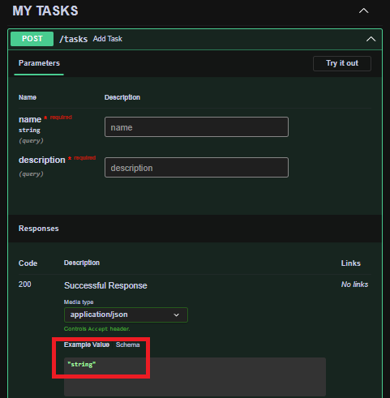

# [Video 2](https://www.youtube.com/watch?v=gBfkX9H3szQ&list=PLeLN0qH0-mCVQKZ8-W1LhxDcVlWtTALCS&index=2&t=167s&pp=iAQB)

## Main commands and places

* `PS C:\...\2_PetProject_FastAPI>`
  * `.venv\Scripts\activate`
  * `uvicorn main:app --reload`
  * <http://127.0.0.1:8000/docs>

## Sequences of actions

* create requirements.txt
  * write whole requirements

  ```txt
    fastapi
    uvicorn 
    sqlalchemy
    aiosqlite
  ```

  !!! note
      - __FastAPI__ web framework is a tool __for building APIs__ between __frontend__ and __backend__
        - from typing import Annotated
        - from fastapi import Depends
      - __uvicorn__ is a __local web server__ and used for development
      - __SQLAlchemy__ is a mapper bitween SQL (relational database) and Python
      - __aiosqlite__ is a lib for async  I/O interface to sqlite database

* crete and activate .venv
  * `PS C:\...\2_PetProject_FastAPI>`
    * `py -m venv .venv`
    * `.venv\Scripts\activate`
    * `pip install -r .\requirements.txt`
    * `python.exe -m pip install --upgrade pip`

* create __app__, an instance of __FastAPI__ class

  ```py
  # main.py
    from fastapi import FastAPI
      
    app = FastAPI()
  ```

* git
  * `$ git init`
  * __.gitignore__

    ```txt
      node_modules
      .venv
    ```

* main:app launch by uvicorn
  * `PS C:\...\2_PetProject_FastAPI>` `uvicorn main:app --reload`
    `INFO: 127.0.0.1:8000 - "GET / HTTP/1.1" 404 Not Found`
    `Uvicorn running on http://127.0.0.1:8000 (Press CTRL+C to quit)`
    * Press __CTRL+C__ for shutting down __app__ if it will be needed later
  * <http://127.0.0.1:8000>

    ```txt
    1| {
    2|    "detail": "Not Found"
    3| }
    ```

* create get request
  * write an endpoint

    ```py
    # main.py
      @app.get("/home")
      def get_home():
        return "Hello world"
    ```

  * <http://127.0.0.1:8000/home>

    ```txt
    1| "Hello world"
    ```

  * rewrite the endpoint

    ```py
    # main.py
      @app.get("/tasks")
      def get_tasks():
        task = Task(name="Write the video", description="for the manager")
        return {"data": task}
    ```

  * <http://127.0.0.1:8000/tasks>

    ```txt
    {
      "data": {
          "name": "Write the video",
          "description": "for the manager"
      }
    } 
    ```

* FastAPI work  
  * <http://127.0.0.1:8000/docs>
    * a view
      
    * press __Try it out__
      
    * press __Execute__ and get as result
      

* Task: create post request
  * __main.py__
    * __STaskAdd__(BaseModel) class where __S - Scheme__
    * STask(__STaskAdd__) class
    * __\@app.post("/tasks")__ endpoint

    ```py
    @app.post("/tasks")
    async def add_task(
      task: STaskAdd,
    ):
      tasks.append(task)
      return {"ok": True}
    ```

  * <http://127.0.0.1:8000/docs#/default/add_task_tasks_post> (__POST__ request)
    * a view
      
    * press __Try it out__
      
      * __name__ and __description__

        ```json
        {
          "name": "Write the video",
          "description": "for the manager"
        }
        ```

        * the fieldes should be changed in __json__ format

* commit 42400dc 10:30 main.py 21 string: task: STaskAdd

* Task: use Depends() and Annotated typing
  * __main.py__

    ```py
    # main.py
      ...
      from fastapi import Depends
      from typing import Annotated
      ...
      @app.post("/tasks")
      async def add_task(
        task: Annotated[STaskAdd, Depends()],
      ):
        tasks.append(task)
        return {"ok": True}
    ```

  * <http://127.0.0.1:8000/docs#/default/add_task_tasks_post> (__POST__ request)
    * a view
      
    * press __Try it out__ and fill the __name__ and __description__ fields in __txt__ format
      
    * press __Execute__ and get as result
      

* commit 2229790 10:40 main.py 21 string: task: Annotated[STaskAdd, Depends()]

* Task: create engine, function to create and drop tables
  * __database.py__
    * import and create __async engine__ for requests to the database
      * sqlite address (URL - Uniform Resource Locator)
      * aiosqlite driver
      * database should be located anywhere on any server or cloud but in the project this is __tasks.bd__

      ```py
      # database.py
        from sqlalchemy.ext.asyncio import create_async_engine

        engine = create_async_engine(
          "sqlite+aiosqlite:///tasks.bd"
        )
      ```

    * import __Async Session Maker__

      ```py
      # database.py
        from sqlalchemy.ext.asyncio import create_async_engine, async_sessionmaker
        ...
        new_session = async_sessionmaker(engine, expire_on_commit=False)
      ```

      * __expire_on_commit=False__ for homework  
    * __DeclarativeBase__
      * from sqlalchemy.orm import DeclarativeBase
      * class Model(DeclarativeBase)
    * description of ORM-table in __class TaskOrm(Model)__
      * [sqlalchemy orm](https://docs.sqlalchemy.org/en/20/orm/quickstart.html)
        * a table is a collection of related data held in a structured format within a database; it consists of rows and columns.
        * an __ORM - Object-Relational Mappin__ is a scheme refers to a technique that allows you to interact with your database using the object-oriented paradigm of your programming language.
      * from sqlalchemy.orm import Mapped, mapped_column
      * __primary_key__ (must be)
    * functions __create_tables()__ (eccording to the author, look it somewhere in docs) and __delete_tables()__

* commit 1fc38ac 15:25 add explanation for main.py 21 string, give ORM-table description in database.py

* commit bf1f6ef 16:00 function to create and drop ORM-tables

* Task: launch uvicorn web server, drop old tables of the database and create a new table
  * [lifespan events](https://fastapi.tiangolo.com/advanced/events/)
    * [async context manager](https://fastapi.tiangolo.com/advanced/events/#:~:text=That%20converts%20the%20function%20into%20something%20called%20an%20%22async%20context%20manager%22.)

     ```py
      # main.py:
        ...
        from contextlib import asynccontextmanager

        @asynccontextmanager

        async def lifespan(app: FastAPI):
            await delete_tables()
            print("DATABASE is cleared")
            await create_tables()
            print("DATABASE is ready")
            yield
            print("DATABASE turning off")

        app = FastAPI(lifespan=lifespan)
        ...
    ```

    * make any change (for example, gap) anywhere in __main.py__ and comeback

    ```termnal
      # uvicorn
      ...
      WARNING:  StatReload detected changes in 'main.py'. Reloading...
      INFO:     Shutting down
      INFO:     Waiting for application shutdown.
        DATABASE off
      INFO:     Application shutdown complete.
      INFO:     Finished server process...
      ...
      INFO:     Started server process [67152]
      INFO:     Waiting for application startup.
        DATABASE is cleared
        DATABASE is ready
      INFO:     Application startup complete
    ```

    Task: ok

* commit 08d9340 19:40 launch uvicorn web server, drop old tables of the database and create a new table

* create __repository.py__ for requests (decomposition of project logic)
  * there is a simple repository without
    * instances of repository
    * [Unit of Work Pattern](https://www.youtube.com/watch?v=TaYg23VkCRI)

    ```py
      # repository.py
      ...
      class TaskRepository:
        @classmethod
        ...
        @classmethod
        ...
    ```

* commit bf34c9b 25:50 init repository.py

* replacement of code snippets from __main.py__
  * `class STaskAdd(BaseModel)` and `class STask(STaskAdd)` to __schemas.py__
  * `@app.post("/tasks")` and `# @app.get("/tasks")` to __router.py__

* commit fb5903f 27:20 replacement of code snippets from main.py to schemas.py and router.py

* Task: include the router, test GET and POST requests
  * change

    ```py
    # router.py
      ...
      router = APIRouter(
        prefix="/tasks",
      )
      ...
    ```

  * replace

    ```py
    # router.py
      ...
      @router.post("")
      ...
        tasks.append(task)
        ...

      @router.get("")
      def get_tasks():
        task = Task(name="Write the video", description="for the manager")
        return {"data": task}
    ```

    by

    ```py
    # router.py
      ...
      @router.post("")
      ...
        task_id = await TaskRepository.add_one(task)
        ...

      @router.get("")
      async def get_tasks():
        tasks = await TaskRepository.find_all()
        return {"data": tasks}
    ```

  * `http://127.0.0.1:8000/docs#/default/add_task_tasks_post`
    * `No operations defined in spec!`

  * include_router()

    ```py
    # main.py
      ...
      from router import router as task_router
      ...
      app.include_router(task_router)    
    ```

* commit 0130d95 include_router, its tag, test GET and POST 29:40

* Task: Typing of GET and POST requests
  * Data Typing is important for frontend
    * GET
      * <http://127.0.0.1:8000/docs/...>
        Response body type: object, Example Value Schema type: string
          

      * include typing of class STask (see schemas.py)

        ```py
        # router.py
          ...
          @router.get("")
            async def get_tasks() -> STask:
            ...
        ```

      * convert objects of database to pydentic schemas

        ```py
        # repository.py
          ...
          @classmethod
          async def find_all(cls) -> list[STask]:
            async with new_session() as session:
              ...
              task_schemas = [STask.model_validate(task_model) for task_model in task_models]
              # return task_models
              return task_schemas
        ```

        ```py
        # router.py
          @router.get("")
          async def get_tasks() -> list[STask]:
            ...
        ```

      * <http://127.0.0.1:8000/docs/...>
        

    * POST
      * <http://127.0.0.1:8000/docs/...> Example Value Schema type: string
        

      * class STaskId()

        ```py
        # schemas.py
          class STaskId(BaseModel):
              ok: bool = True
              id: int
        ```

      * STaskId type in post request

        ```py
        # router.py
          ...
          @router.post("")
          async def add_task(
              task: Annotated[STaskAdd, Depends()],
          ) -> STaskId:
          ...
        ```

      * <http://127.0.0.1:8000/docs/...>
        

* commit a0fea41 Typing of GET and POST requests 34:22

* __Docker__
  * It is a containerization (boxing) tool
  * fast and simple example of Docker
  * __Dockerfile__
  * a new terminal named for example docker.

    ```powershell
      PS C:\...\2_PetProject_FastAPI> .venv\Scripts\activate
      (.venv) PS C:\...\2_PetProject_FastAPI> pip freeze > requirements.txt
      (.venv) PS C:\...\2_PetProject_FastAPI>
    ```

    * __requirements.txt__ added and formatted
  * __.dockerignore__

* commit fac9f37 Docker 37:10

* __GitHub__
  * `https://github.com/dashboard`
    * press __New__ button
      * write __Repository name__
      * __Public__ radio-button
      * press __Create repository__ button
        * copy whole code snippet under
        __…or create a new repository on the command line__

  * VS Code terminal of project
    * insert

      ```bash
        echo "# pky" >> README.md
        git init
        git add README.md
        git commit -m "first commit"
        git branch -M main
        git remote add origin <git@github.com>:AleksandrKrasovski/pky.git
        git push -u origin main
      ```

        !!! note
            - `git init` may be omitted if the project is already under git-control
            - the commit inside `git commit -m "first commit"` may be customized by the same reason

  * delete repository if it is needed
    * <https://docs.github.com/en/repositories/creating-and-managing-repositories/deleting-a-repository>

* commit 5ef464e github repository named fastapi_db_simplex 39:00

* Selectel Claud server
  * <https://my.selectel.ru/vpc/aee65b97490f4e668635258e28b637fc/servers?region=ru-9>
    
  * IP 31.129.57.80

* connection to serser
  
  
  ```bash
  # terminal
    C:\...>ssh root@31.129.57.80
    ..
    yes
    ..
    root>@31.129.57.80's password:
    Welcome to Ubuntu 22.04.4 LTS (GNU/Linux 5.15.0-102-generic x86_64)
    ..
    root@lora:~# clear
  ```

  !!! note
      the password is not inserted explicitly

* install Git on the claud server
  
  ```bash
  # terminal
    root@lora:~# sudo apt-get update 
    ..
    root@lora:~# sudo apt-get install git
  ```
  
* install Docker on the claud server from the [source](https://docs.docker.com/engine/install/ubuntu/#:~:text=Set%20up%20Docker%27s,repository.)  

  * terminal

    ```bash  
      root@lora:~# # Add Docker's official GPG key
      sudo apt-get update
      sudo apt-get install ca-certificates curl
      sudo install -m 0755 -d /etc/apt/keyrings
      sudo curl -fsSL <https://download.docker.com/linux/ubuntu/gpg> -o /etc/apt/keyrings/docker.asc
      sudo chmod a+r /etc/apt/keyrings/docker.asc

      # Add the repository to Apt sources
      echo \
        "deb [arch=$(dpkg --print-architecture) signed-by=/etc/apt/keyrings/docker.asc] https://download.docker.com/linux/ubuntu \
        $(. /etc/os-release && echo "$VERSION_CODENAME") stable" | \
        sudo tee /etc/apt/sources.list.d/docker.list > /dev/null
      sudo apt-get update
    ```

    ```bash
      root@lora:~# sudo apt-get install docker-ce docker-ce-cli containerd.io docker-buildx-plugin docker-compose-plugin
      ..
      root@lora:~# clear
    ```

    ```bash
      root@lora:~# git
      ..
      These are common Git commands used in various situations:
      ..
      root@lora:~# clear
    ```

    ```bash
      root@lora:~# docker

      Usage:  docker [OPTIONS] COMMAND
      ..
      root@lora:~# clear
    ```

    !!! note
        - <https://github.com/AleksandrKrasovski/fastapi_db_simplex>
          - Code / Local Clone / HTTPS / __copy__
            - <https://github.com/AleksandrKrasovski/fastapi_db_simplex.git>

    ```bash
      root@lora:~# git clone https://github.com/AleksandrKrasovski/fastapi_db_simplex.git
      Cloning into 'fastapi_db_simplex'..
      ..
      Resolving deltas: 100% .. done.
    ```

    ```bash
      root@lora:~# ls
      fastapi_db_simplex

      root@lora:~# cd fastapi_db_simplex
      root@lora:~/fastapi_db_simplex#

      root@lora:~/fastapi_db_simplex# ls
      Dockerfile   README.md    database.py  repository.py     router.py   tasks.bd
      Explanation  __pycache__  main.py      requirements.txt  schemas.py
    ```

* launch docker
  
  ```bash
    root@lora:~/fastapi_db_simplex# docker build . --tag fastapi__app && docker run -p 80:80 fastapi__app
  ```
  
  ```bash
    0 fastapi__app
    [+] Building 1.7s (2/2) FINISHED                                        docker:default
     => [internal] load build definition from Dockerfile                              0.4s
     => => transferring dockerfile: 174B                                              0.0s
     => ERROR [internal] load metadata for docker.io/library/python:3.11-slim_        1.0s

    ------
     > [internal] load metadata for docker.io/library/python:3.11-slim_:
    ------

    Dockerfile:1
    --------------------

    1 | >>> FROM python:3.11-slim_
       2 |
       3 |     COPY .
    --------------------

    ERROR: failed to solve: python:3.11-slim_: failed to resolve source metadata for docker.io/library/python:3.11-slim_: docker.io/library/python:3.11-slim_: not found
    root@lora:~/fastapi_db_simplex#
  ```
